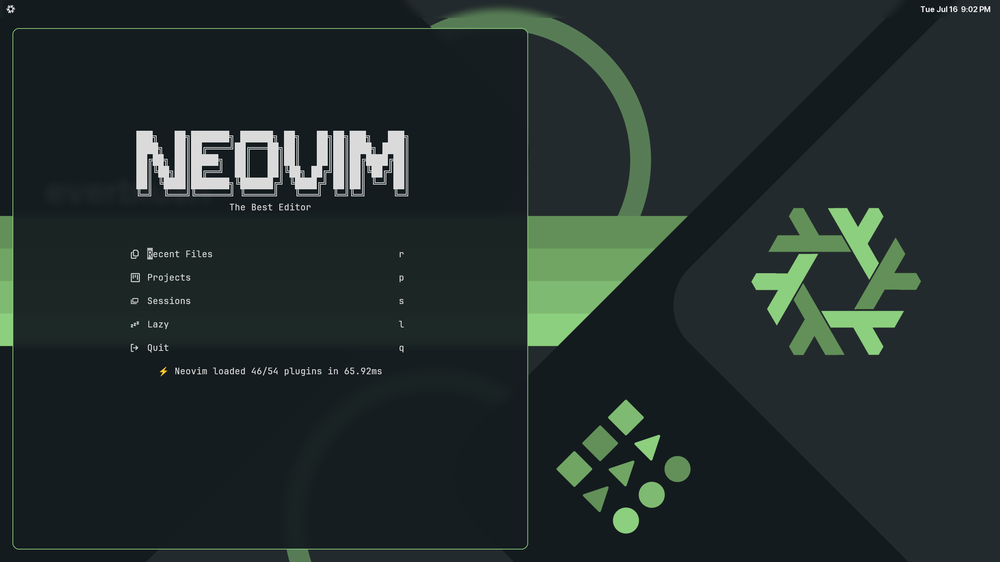

# Nix-Config

This is my NixOS configurations, only for my desktop computer currently as I don't have a laptop yet.

Don't use this configuration, you can reference it but please don't use it for your system it will likely break.

